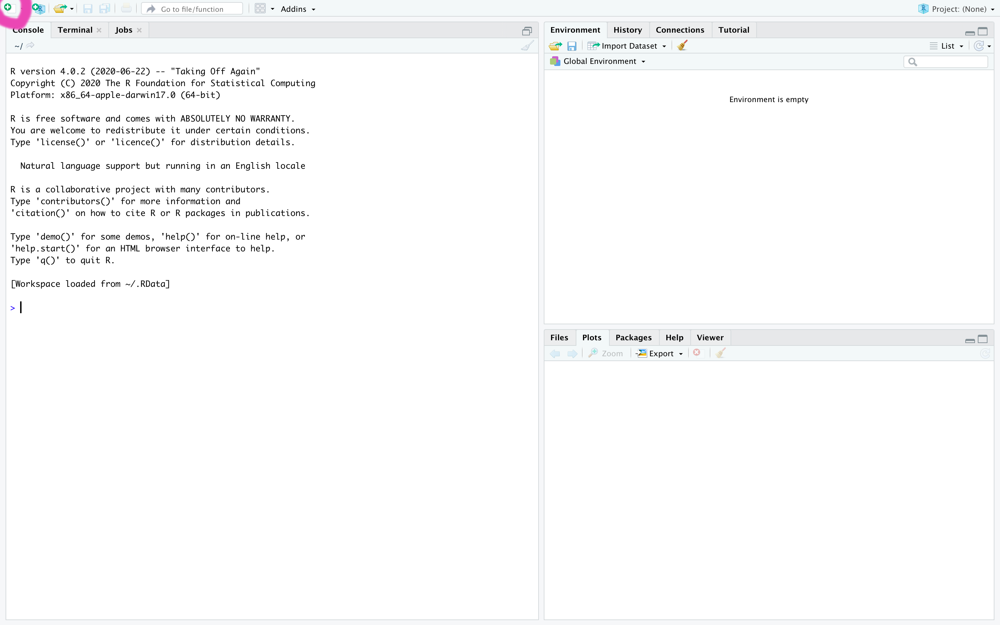
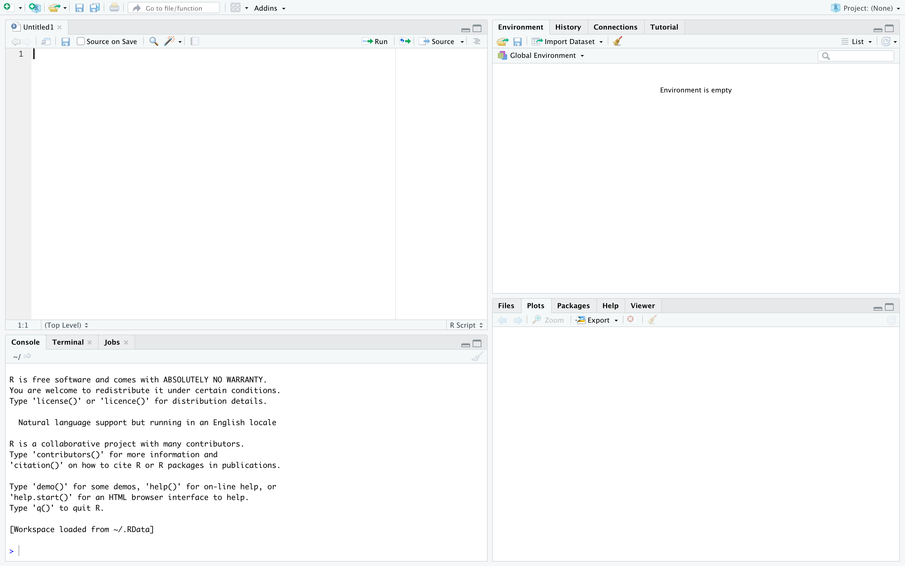
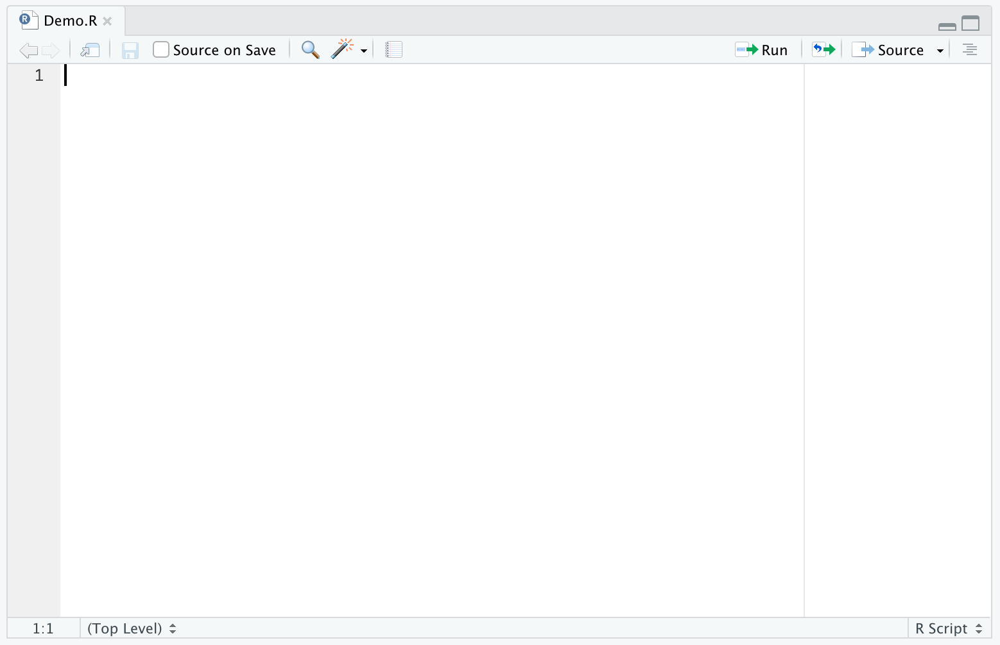
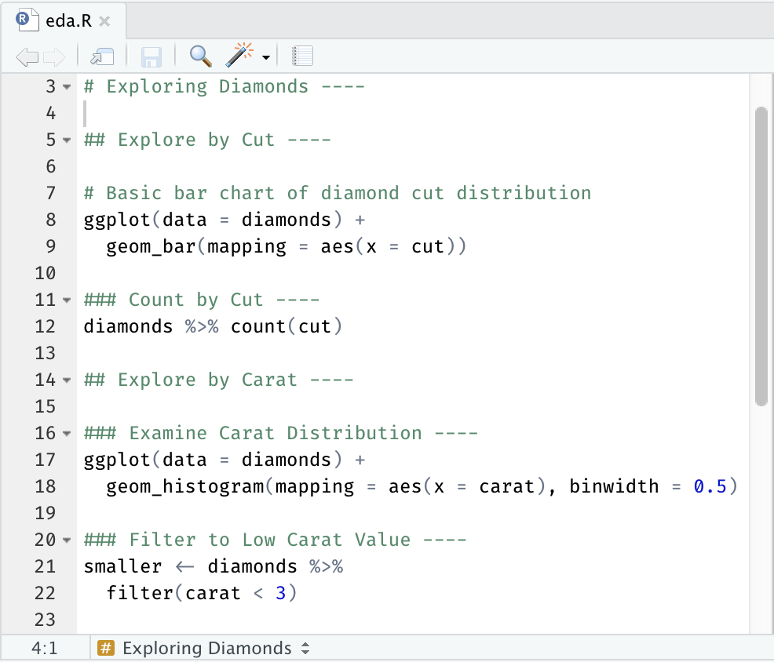
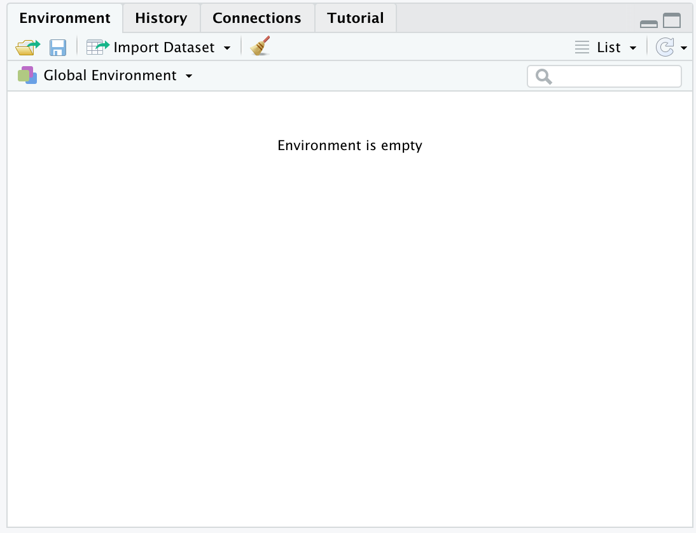
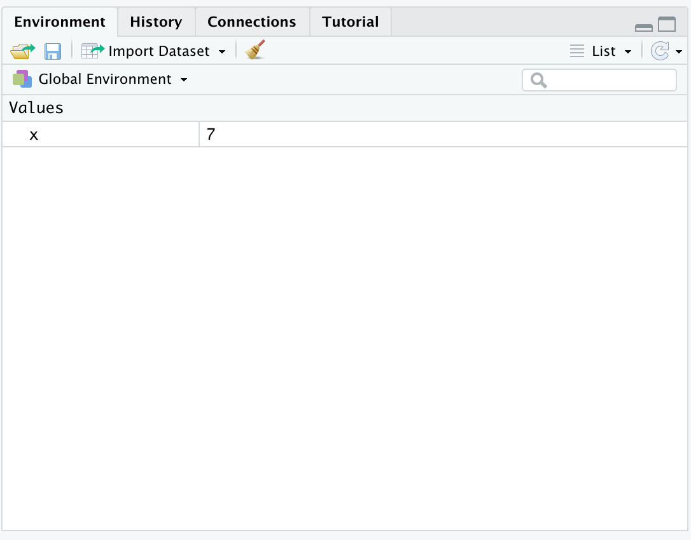

## Using RStudio

Hi everyone, welcome to the R section of the data learning labs! What is R? R is a programming language. Other programming languages include Python, Java, C, and more. Different programming languages are better for different tasks. R is commonly used for data analysis and visualizations. Many people use a tool called RStudio, which we will over the next few days. RStudio allows you to write code in R, run that code, and more!

In this chapter, we walk through RStudio so you have an understanding of its main functionality and its relationship with the R programming language. If you have not yet installed R and RStudio, please refer to the 
[Pre-Workshop Installation Guide](https://tinyurl.com/ssrpsoftwareguide) 
and follow the instructions to install R and RStudio. 
Follow along with the steps below on your own computer. 
_There is a video at the end that walks through most of the content as well._

### R Scripts in RStudio

When you first open RStudio, it will look something like this. 


Most of the time, you will be working with an R script or an R markdown file. In this section, we will cover R scripts. R markdown files will be covered in the next section. To open a new R script, click the button in the upper left hand corner shown below. 



When you click that button, you should see a dropdown menu like in the picture below. 


After clicking on "R Script" you will have created a new, blank R script that should pop up. Your RStudio should now look like this. 



To start, let's save our script so that if our computer crashes we don't lose all our progress. You can do this by clicking File -> Save, or Command + S, or Ctrl + S depending on if you are on a Mac or PC. Let's name our file "Demo.R". Including the .R at the end of the file name indicates to your computer that it is an R script.

Now, let's look at each of the sections of R Studio in more depth. First, let's look at the top left, shown in the screenshot below.



This is your R script. Here is where you can write blocks of R code to run. You will do a majority of your coding here. When you've written some code, a fully written script might look something like this. 



Don't worry if it doesn't make sense to you now - by the end of the week you'll be able to write code just like it! You will see a few icons near the top of the screen. The arrows allow you to navigate between files if you have multiple files open. You can also click on the tabs that will appear on the top of the screen. There's also a button to make your code pop up in a different window, if you prefer, and a save button. You will also see a checkbox next to text that says "Source on Save". In R, source means run. If you check the box next to "Source on Save" your code will run every time you save it. There are a few other tools that can help you manipulate your code.

The most important buttons are on the righthand side, "Run" and "Source". If you click run, the line of code where your cursor is will run. If you have a block of code highlighted, that block will run. You can click source to run all your code in the script. If you click the arrow next to source, there's a "Source with Echo" option that will print each line of code in the console as it runs.

### Console and Terminal

Now, we'll move to the lower left corner, as shown in the figure below. 


You will see there are three sections: Console, Terminal, and Jobs. The Console is a place where R is up and running, waiting for you to enter commands. As we progress through the course you will learn how to do increasingly complex things in R. For now, we can work with a simple functionality of R: adding numbers. Try typing 5+11 in the console and pressing enter. You should see 16 output below like in the figure. 


It's important to note that the console is not a good place to write lots of R code. It is useful for simple commands that only need to be run one time. You can also use it to help debug lines of code. For example, if you're trying to figure out how to do something, you can try playing with it in the console until the output is what you expect. Then, you can add it to your script above. When you run code if there is any output (e.g. if you print something) it will show up in the console.

Now, let's look at the terminal. The terminal here is the same as the terminal you learned about in previous days! It's just another way to access it, and run the same commands. Try playing around with some of the commands you learned about in the previous days!

Lastly, there is a jobs tab. Just like with remote machines, you can run jobs locally in RStudio. You'll see a broom in each of the Console, Terminal, and Jobs tabs. This simply clears what's there so you can start fresh.

### Environment and History

Now, let's move to the upper right corner. 



This tab shows your environment. The environment contains any data that you may have saved as part of running your code. Your environment is probably empty right now. Try typing `x <- 7` in the console. 



This will store the value 7 in a variable called x. You should now see a variable named x pop up with the value 7!  You can also store other types of data in variables. Try typing `y <- "hello"` in your console. Now if you type `y`, you should see "hello" printed! 

If needed, you can save your current environment and all the variables in it (also called a workspace) by clicking the save button on top. Directly to the left of the save button is a button to load a pre-existing workspace. This can be useful if you have been doing analysis in the console instead of a script and want to save some of your variables to share with someone else. 

The history tab shows a history of commands you have run. If you double click on a command, it will put it in the console for you and you can click enter to run it. However, be careful that some environment variables may have changed! Try typing `x` in the console to see the value of x. You should 7 print out. Now try typing `x <- x+2` in the console. You should see the value 9. The line of code we just wrote took the value of x, added 2, and stored that new value in x. Because x was 7, the new value is 9. If you type `x` again, you'll see the value 9 print out. Similarly, if you use the same command from your history, if any of the variables involved as changed, the output may be different. Once you overwrite a variable, you cannot recover its old value!

You will probably not use these last two tabs. The connection tab allows you to connect to some kinds of external databases (though more commonly your mentors will provide you with some data files for you to load in a script). The tutorial tab can help walk you through various things in R.

### Files, Plots, and Packages

Lastly, we will move to the bottom right. The first tab, Files, is like a small version of Finder or the Windows File Browser. The Plots tab will show any plots you might make. The Packages tab shows all packages you have installed (like tidyverse, which we will use later!), with check marks indicating which ones are loaded. The Help tab has some resources you can use, though googling and searching for your problem on websites like Stack Overflow will also be useful.

### Putting It All Together

Let's put what we've learned together. Copy the code below and paste it into a blank R script.


```r
x <- c(1,2,3)
print(x)
```

```
## [1] 1 2 3
```

```r
print(sum(x))
```

```
## [1] 6
```

```r
x[1] <- 0
print(x)
```

```
## [1] 0 2 3
```

```r
print(sum(x))
```

```
## [1] 5
```
The first line of code stores a vector of numbers into the variable x. The next line prints that list. The next line takes the sum of those numbers and prints that. A command that does something else is called a function. Here, sum is a function that takes a vector of numbers as its input, and outputs the sum of all the numbers.

The next line of code changes the first value in the vector and replaces it with 3. We can see that change when we print the vector. We can also see the sum changed accordingly. In R, whenever we call a function we write the name of the number, then put the inputs (also called arguments) in parenthesis after the name of the function. There are other built in functions like mean() and min(). We can also write our own functions. We'll work with functions more throughout the week.
