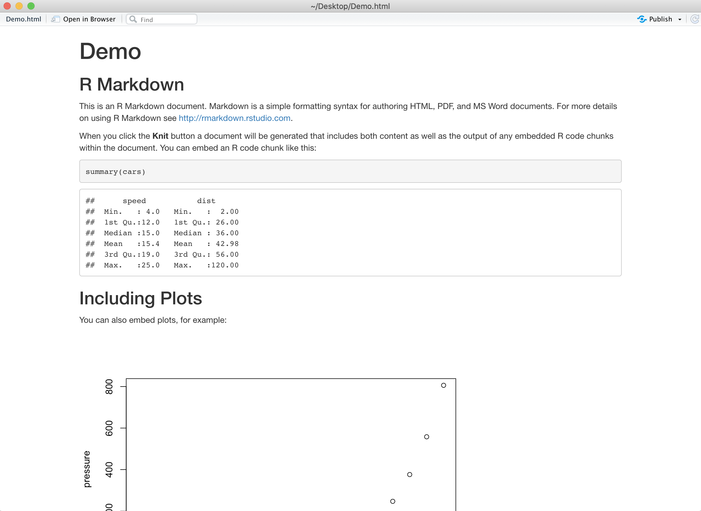
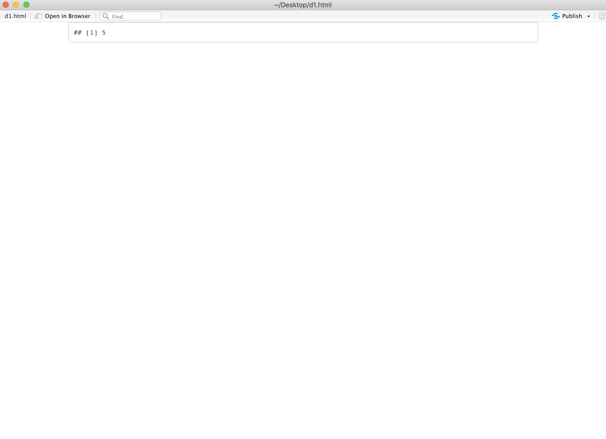

## Using Rmds

Throughout the next few days we will be using another type of file that can run R code called and R Markdown file, or Rmd. To create a new Rmd file click the same box in the upper left corner as you did when creating a new R Script, but instead of R Script, click on R Markdown (3rd box from the top). Make the title of your file `Demo`, and click OK (keep the default output as HTML). A new file will be created that looks like this .


Save the file, making sure to put `.Rmd` at the end of the file name so your computer knows it's an R Markdown file.

### Basic Structure

An R Markdown file has two main parts: R code and Markdown code, hence the name R Markdown. Markdown is a language that was designed for writing text that converts easily to HTML format. People might use Markdown to write blog posts on their website, or to provide context to an R analysis! We can use R Markdown files to create a nice writeup that explains what we're doing in our analysis. We can insert chunks of R code where needed, and display either the actual code, or the text / figures generated from the code. In fact, this tutorial is all written in R Markdown! The next few sections will discuss how to write in Markdown, how to insert a chunk of R code, and how to put it all together.

### Overview of Markdown

In Markdown, you can type text just like you would in a word document. If you need a new paragraph, just hit enter twice (so there is a gap between text). You can also press the space bar _twice_ at the end of a sentence to create a new line. You can also create headers in Markdown using the #. You can type from 1-6 #s, followed by a space, and then the header. Click on "Knit" at the top of the page in your Rmd file. You should see a window pop up with the compiled file. "R Markdown" in big, bold letters, with text underneath, like below. 

Close the window with the compiled R Markdown. Change the number of # symbols in front of the text "R Markdown" on line 10. Now try clicking "Knit" again. You should see the text get smaller as you increase the number of #! You can also make text italicized by putting a single asterisk `*` on both sides of the text. Try italicizing some text in your demo file, and make sure you click "Knit" and check! You can bold text with `**` on both sides. You can bold *AND* italicize with triple asterisks on both sides. More detail about markdown can be found [here](https://www.markdownguide.org/basic-syntax/). Click the link and spend a few minutes playing around with Markdown!

### Overview of how to write an R chunk

The next part of an R Markdown file is the R. You can insert a chunk of R code by writing the following 

This will run the code in the block! Try adding that block of code somewhere in your demo Rmd file. In case you're having trouble finding it, the character that's repeated three times is the backtick, it's usually on the upper left of your keyboard. You should now see output that looks like this in your R Markdown file; make sure you Knit the Rmd file to check!


```r
print('This is R code!')
```

```
## [1] "This is R code!"
```

You'll notice that there's some R code chunks already present in your R Markdown file. Let's talk about them! The first code chunk looks like this 

Let's talk about `{r setup, include=FALSE}`. The first character `r` just indicates that this is an R code chunk. Then, there is a space followed by `setup`. This is a name for the code chunk and is option. It cannot contain any spaces. Then, following the comma, you'll see `include=FALSE`. This means that the code is not visible in the Rmd file once compiled and neither is the output. However, the code chunk is still run. Create a new Rmd file, but click "Create empty document" instead of "Ok" on the pop up menu. Now, create a code chunk that looks like this 

When you click Knit, you'll get an error because we haven't defined x! Put a new code chunk _before_ that one where you set `include=FALSE` and define x to be a number in that code chunk (remember you set variables with the arrow operator, like `x <- 5`). 

Now, let's say that you only wanted to print the value of x, but didn't want the code to show up. In the second code chunk where you are printing x, set echo=FALSE. Remember to include a comma after the `r` (or after the name of the chunk, if you gave it a name). Now, when you knit the file, you should only see the value of x printed, like this: 

Now, let's say you wanted to show someone how they write some code, but you don't actually want to run it. Change `echo=FALSE` to 'eval=FALSE`. Now, when you knit the Rmd, you should see the code but not the printed output, like this: .

If an Rmd file is taking a long time to knit, that could be because some of the code is taking a long time to run. The code is rerun every time you knit the file! If this is the case, you can add a `cache=TRUE` flag to a code chunk which will stop it from running every time you knit the Rmd file. It will only run if you change something. You can add multiple flags to a code chunk by using commas between them.

### Final Thoughts

R Markdown files tend to be useful for creating reports that integrate text, code, and figures. We will be using them throughout the next few days as an interface to practice writing chunks of R.
